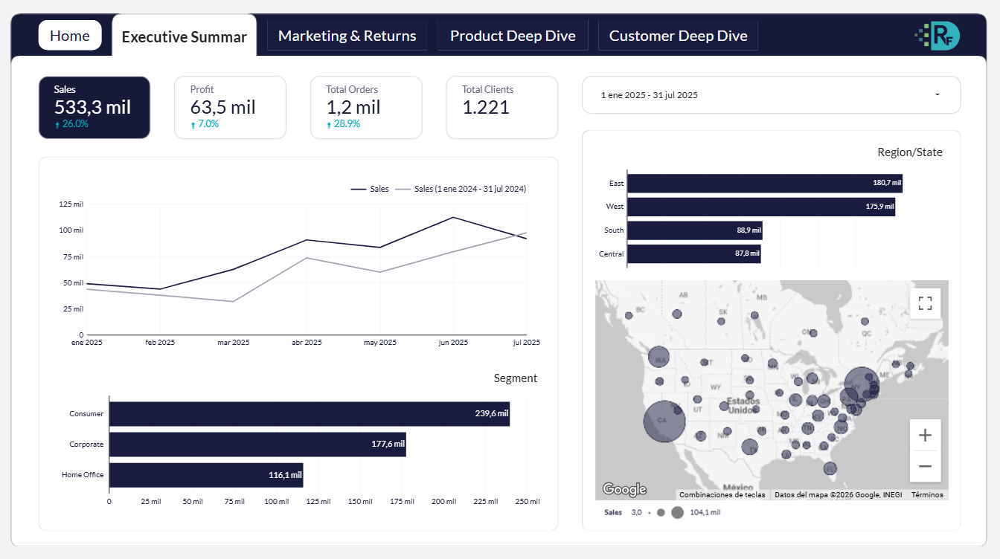
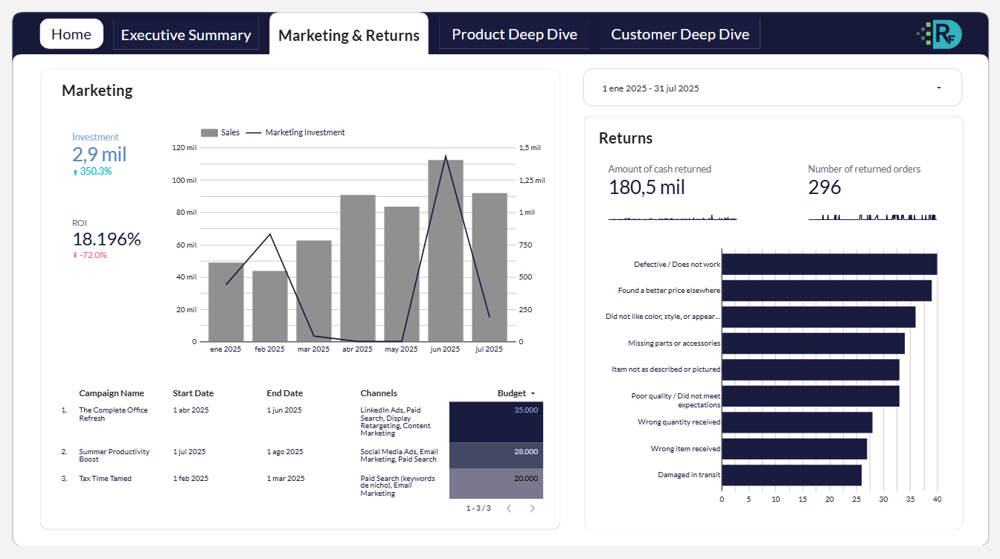
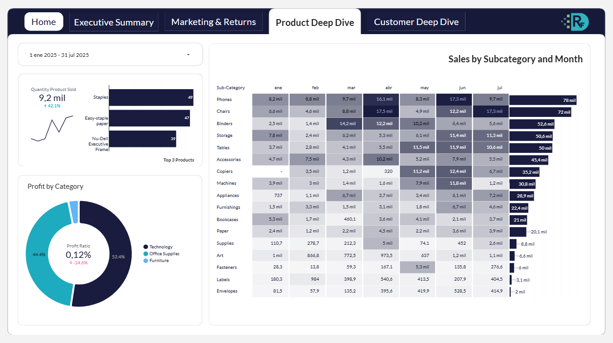
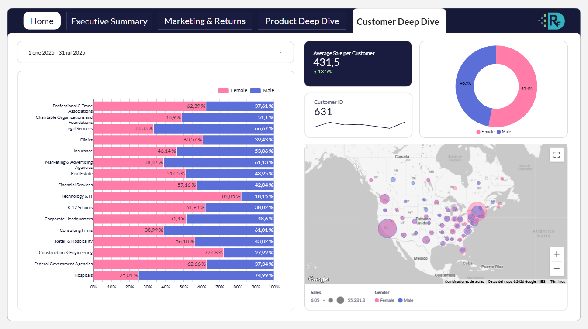

# **Superstore Sales Performance Review 2025**

Análisis del rendimiento de ventas de una superstore durante 2025, desarrollado en Looker Studio. El proyecto integra diferentes fuentes de datos para construir un dashboard interactivo orientado al análisis del desempeño comercial, marketing, productos y clientes.

## Objetivo

El objetivo fue desarrollar un dashboard interactivo que permitiera evaluar el desempeño de las ventas durante 2025, identificar tendencias y patrones comerciales, y facilitar el análisis desde diferentes perspectivas del negocio. El análisis se centra en el periodo enero-julio de 2025, comparándolo con el mismo periodo de 2024.

## Dataset

El proyecto integra cuatro fuentes de datos:

* `Sample - Superstore - Customers.csv`: información de clientes.
* `Sample - Superstore - Marketing.csv`: información relacionada con las actividades de marketing.
* `Sample - Superstore - Orders.csv`: información de pedidos y ventas.
* `Sample - Superstore - Returns.csv`: información relacionada con devoluciones.

Las fuentes se integran mediante diferentes relaciones entre pedidos, clientes, devoluciones y fechas.

## Proceso de análisis

1. **Análisis de las fuentes:** revisión de las diferentes bases de datos y de las relaciones disponibles entre ellas.

2. **Integración de datos:** conexión de las fuentes necesarias para construir una visión conjunta del desempeño comercial.

3. **Análisis exploratorio:** evaluación de ventas, ganancias, pedidos, clientes, productos, devoluciones y marketing.

4. **Dashboard:** construcción de un dashboard interactivo en Looker Studio, organizado en diferentes apartados para facilitar el análisis desde una perspectiva ejecutiva y operativa.

## Dashboard

El dashboard se divide en cuatro apartados principales:

### Executive Summary

Presenta una visión general del desempeño comercial, incluyendo ventas, ganancias, pedidos y clientes, así como su evolución temporal y distribución por segmentos y regiones.

### Marketing & Returns

Analiza la relación entre la inversión en marketing, las ventas y el retorno de la inversión, además del impacto de las devoluciones sobre el desempeño comercial.

### Product Deep Dive

Explora el desempeño de los productos y categorías mediante métricas de ventas, unidades vendidas y ganancias.

### Customer Deep Dive

Analiza la base de clientes desde diferentes perspectivas, incluyendo distribución geográfica, industria, género y comportamiento de compra.

## Dashboard interactivo

El proyecto completo puede consultarse de forma interactiva en Looker Studio: [Ver dashboard interactivo](https://datastudio.google.com/s/i-nXKxA19zU).

## Principales hallazgos

* Las ventas durante enero-julio de 2025 aumentaron 26.0% respecto al mismo periodo de 2024, mientras que las ganancias aumentaron 7.0%.
* El número de pedidos aumentó 28.9%, mientras que el número de clientes se mantuvo cercano al número de pedidos.
* Los segmentos Consumer y Corporate concentran una parte importante de las ventas, mientras que las regiones East y West presentan los mayores valores.
* La inversión en marketing aumentó 350.3%, mientras que el ROI reportado fue de -72%.
* Las unidades vendidas aumentaron 42.1% durante el periodo analizado.
* Technology y Office Supplies concentran la mayor parte de las ganancias por categoría.
* El análisis de clientes contempla 631 clientes únicos durante enero-julio de 2025, con una distribución de 53.1% mujeres y 46.9% hombres.

## Herramientas

* La herramienta principal durante todo el proyecto fue Looker Studio (Data Studio).

## Archivos

* `data/`: bases de datos utilizadas en el análisis.
* `dashboard/`: versión estática del dashboard en formato PDF.
* `documentation/`: documentación detallada del proyecto.
* `images/`: capturas de los diferentes apartados del dashboard.

## Documentación

La [documentación completa](documentation/project_documentation.pdf) del proyecto incluye el escenario de negocio, análisis de las fuentes de datos, preguntas de análisis, desarrollo de cada apartado del dashboard y principales hallazgos.

## Fuente de datos

Dataset **Sample - Superstore**, utilizado como base para el análisis de ventas, clientes, devoluciones y marketing.
